# 高校选课系统

选课开放的那一秒，几千名学生同时抢同一批名额。这个项目把「名额扣减」这一步从数据库前移到 Redis，用一段 Lua 脚本让判重、判余量、扣减、登记四个动作变成不可分割的一次操作，从机制上消除超选；数据库写入则交给消息队列异步完成。

项目同时实现了**四种名额扣减方案**，共用完全相同的业务代码，可以在服务运行期间切换，用来做对照实验——这是它和一般"选课系统"demo 最大的不同：它不只给出一个方案，还测出了几个方案之间到底差多少。

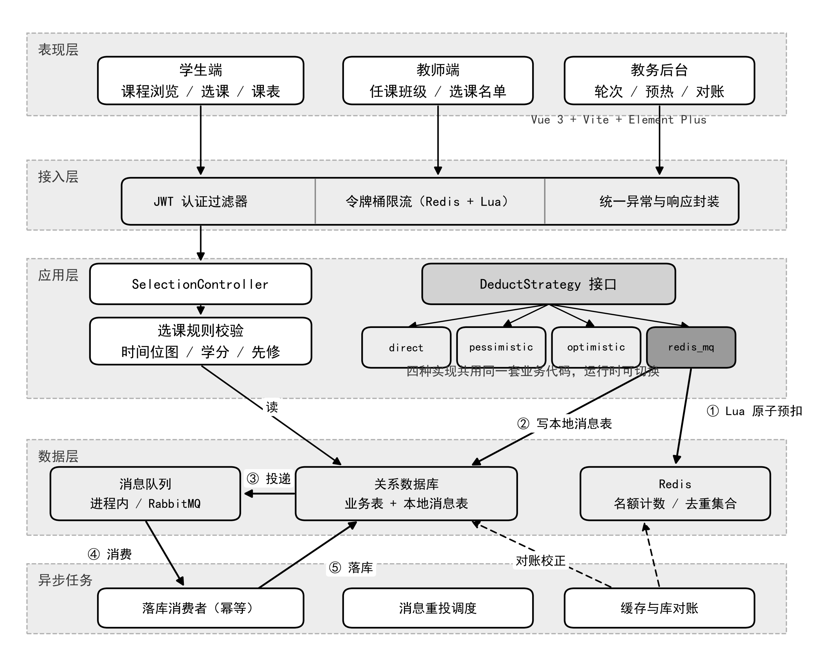

---

## 它解决的问题：超选

「查询剩余名额 → 判断是否大于零 → 执行扣减」这三步在并发下不是原子的。两个请求可能同时读到"还剩 1 个"，于是双双通过判断，各扣一个——容量 50 的教学班最后收了 51 个人。

下面是实测。500 并发抢 50 个名额，无保护的直接扣减把余量打到了 **−450**：

| 方案 | 成功数 | 最终余量 | 超选 | 重试次数 | QPS |
|---|---|---|---|---|---|
| 无保护直接扣减 | 500 | **−450** | **450** | 0 | 542 |
| WATCH 乐观锁 | 50 | 0 | 0 | 3273 | 475 |
| **Lua 原子脚本** | 50 | 0 | **0** | 0 | **3627** |

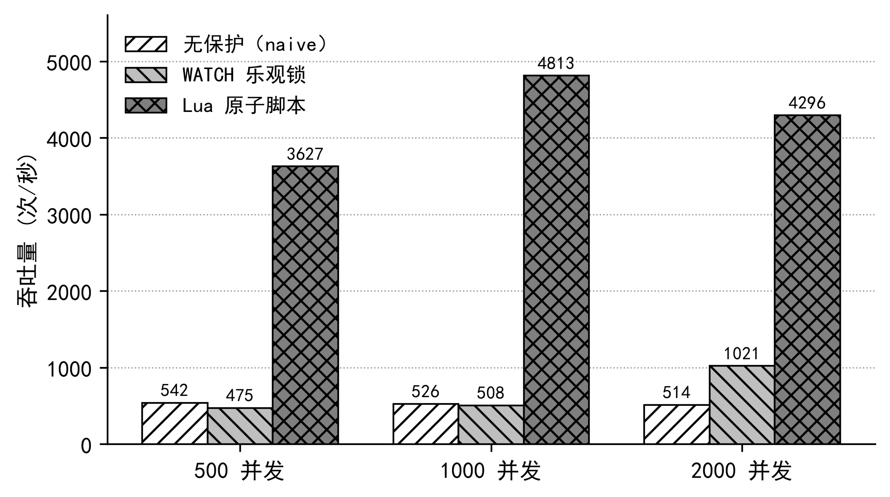

WATCH 方案正确性没问题，但它靠的是「冲突了就重试」——3273 次重试换来 50 次成功，98.5% 的计算是白做的。Lua 把判断和扣减合并成一次服务端执行，既没有冲突也不需要重试，吞吐是前者的 **7.6 倍**。

### 一个更值得注意的结论：超选是概率性的

在完整 HTTP 链路上重复跑 10 轮 2000 并发，无保护方案**只有 4 轮超选，6 轮正常**：

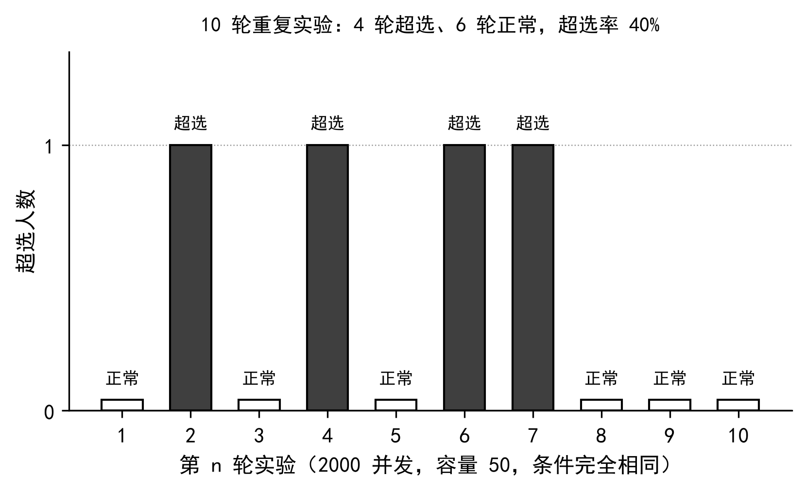

这比"一定会超选"更危险。一个偶尔才出错的系统，"我测了几次都没问题"根本不能当作它正确的证据。

---

## 核心设计

### 1 · Lua 原子预扣

Redis 主线程单线程执行命令，`EVAL` 期间不会插入其他命令。所以把四个动作写进同一段脚本，它们就是原子的：

```lua
-- 判重必须写在脚本里：放在脚本外就是两次独立往返，
-- 同一学生的两个并发请求会双双通过判重，然后各扣一个名额。
if redis.call('SISMEMBER', KEYS[2], ARGV[1]) == 1 then
    return -1
end

local remain = redis.call('GET', KEYS[1])
if not remain then
    return -2          -- 未预热，调用方降级走数据库
end
if tonumber(remain) <= 0 then
    return 0           -- 名额已满
end

redis.call('DECR', KEYS[1])
redis.call('SADD', KEYS[2], ARGV[1])
return 1
```

完整脚本见 [`deduct.lua`](backend/src/main/resources/lua/deduct.lua)。

返回 `-2` 是刻意设计的：教务忘了执行名额预热时，系统降级走数据库悲观锁，而不是把所有学生的请求都拒掉。

### 2 · 时间位图：O(1) 的冲突检测

判断新课和已选课程是否时间冲突，朴素做法是两两比对时段，复杂度 O(n×m)。这里把一周离散成 7 天 × 12 节 = 84 个槽，压进两个 `long`，冲突判断退化成两次按位与：

```java
return (a[0] & b[0]) != 0 || (a[1] & b[1]) != 0;
```

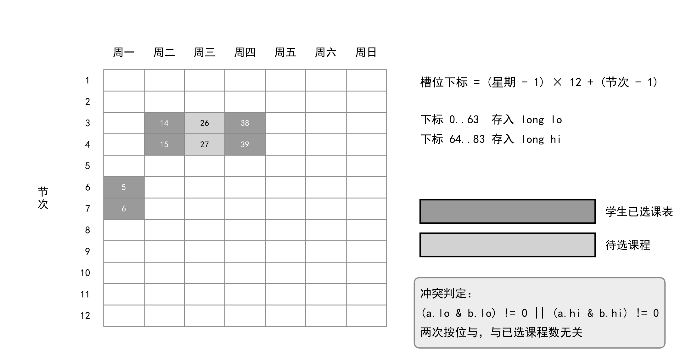

实测（每档 3 次取最小值，已排除 JIT 预热与缓存局部性干扰）：

| 已选课程数 | 朴素实现 平均 | 朴素实现 最坏 | 位图 |
|---|---|---|---|
| 2 | 81.8 ms | 90.8 ms | 3.7 ms |
| 6 | 142.6 ms | 232.0 ms | 3.5 ms |
| 12 | 178.9 ms | 414.9 ms | **3.7 ms** |

位图耗时**与已选课程数无关**。按位与的结果本身还指明了冲突在哪几节，可以直接告诉学生"周三第 4、5 节冲突"，而不是笼统一句"时间冲突"。

### 3 · 本地消息表：异步落库不丢数据

预扣成功就返回，数据库写入交给消息队列。风险是"Redis 扣了名额，消息却没投出去"。解法是把待发送的消息与业务操作写进**同一个数据库事务**，再投递；投递失败由定时任务按指数退避重投。

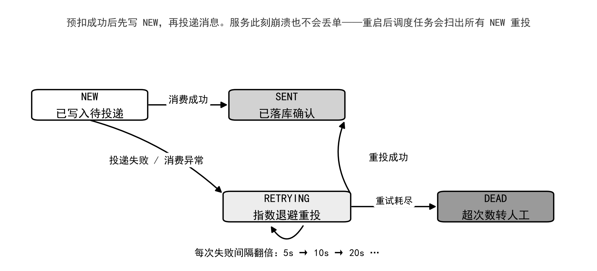

消费端幂等靠选课记录表上 `(学生号, 教学班号)` 的唯一索引——重复消费触发唯一键冲突，捕获后视为成功。这一层不依赖任何应用层判断。

完整时序：

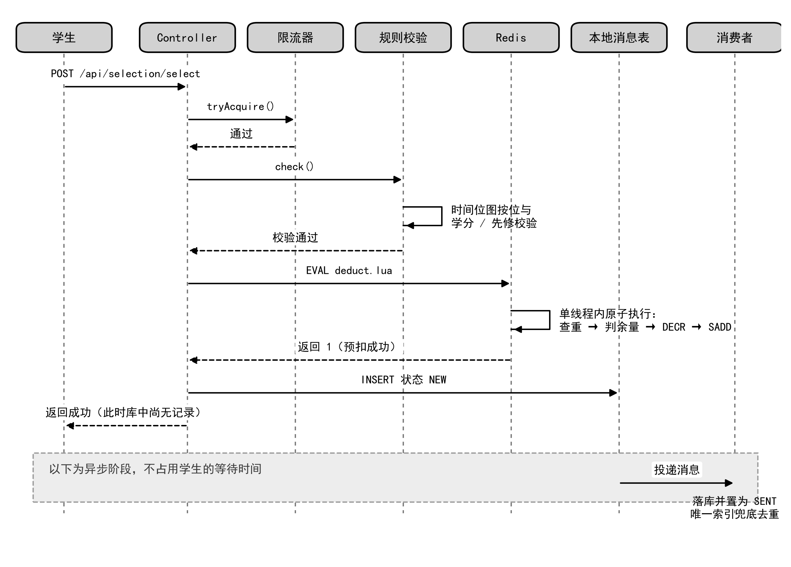

---

## 一个必须说清楚的实验结果

**在完整 HTTP 链路上，四种方案的吞吐没有显著差异，本方案甚至略低。**

| 方案 | 1000 并发 | 2000 并发 | 3000 并发 | 超选 |
|---|---|---|---|---|
| direct 直接扣减 | 1171 | 1208 | 1323 | **有** |
| pessimistic 悲观锁 | 1178 | 1203 | 1193 | 无 |
| optimistic 乐观锁 | 1233 | 1168 | 1256 | 无 |
| **redis_mq 本方案** | 1086 | 1053 | 1057 | 无 |

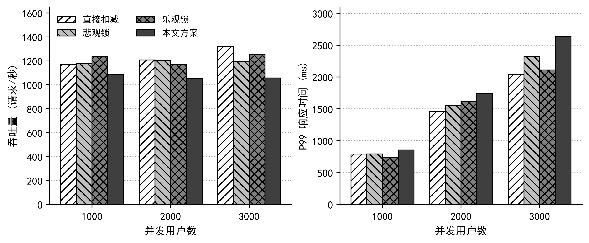

原因是扣减只占一次请求的很小一部分：一次选课要走 JWT 解析、令牌桶限流、轮次查询、学生查询、教学班查询、时间冲突与学分先修校验，最后才是扣减。前面这些是四种方案**共有**的，把差异摊平了。本方案还在同步路径上多写了一次本地消息表，所以略低。

它真正的价值不在单次请求的快慢，而在**把数据库写入移出了请求链路**。这个优势要等数据库成为瓶颈时才显现，而本项目用的是 H2 内存库，数据库根本没被压垮，所以测不出来。

写出来而不是藏起来，是因为这个数据本身说明了一件事：**性能优化的收益取决于瓶颈在哪里，脱离瓶颈谈倍数没有意义。**

---

## 界面

<table>
<tr>
<td width="50%">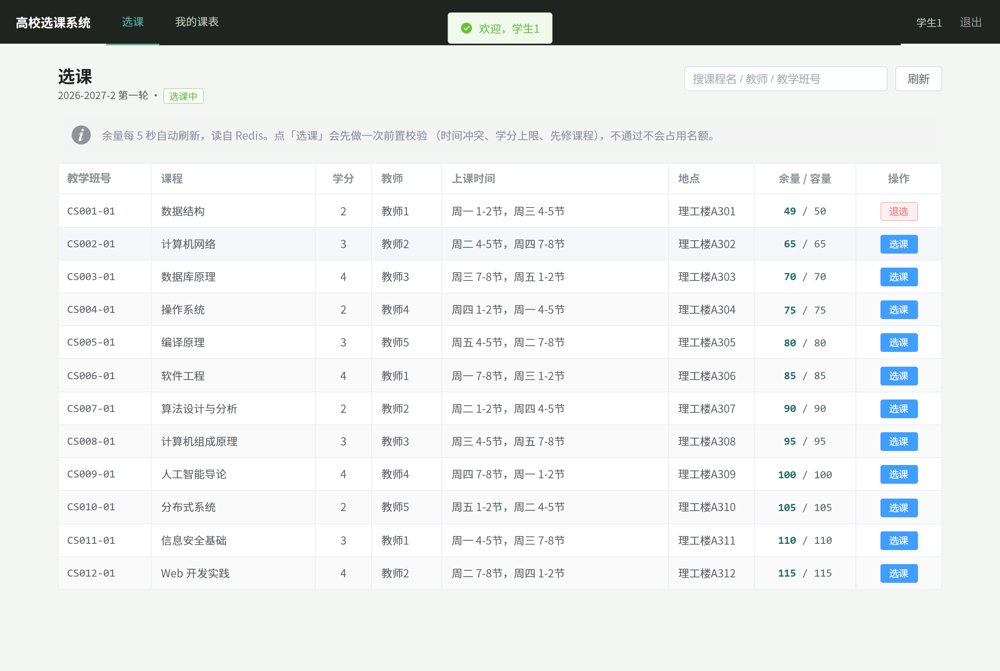<br><sub><b>学生 · 选课</b>　余量每 5 秒刷新，直接读 Redis</sub></td>
<td width="50%">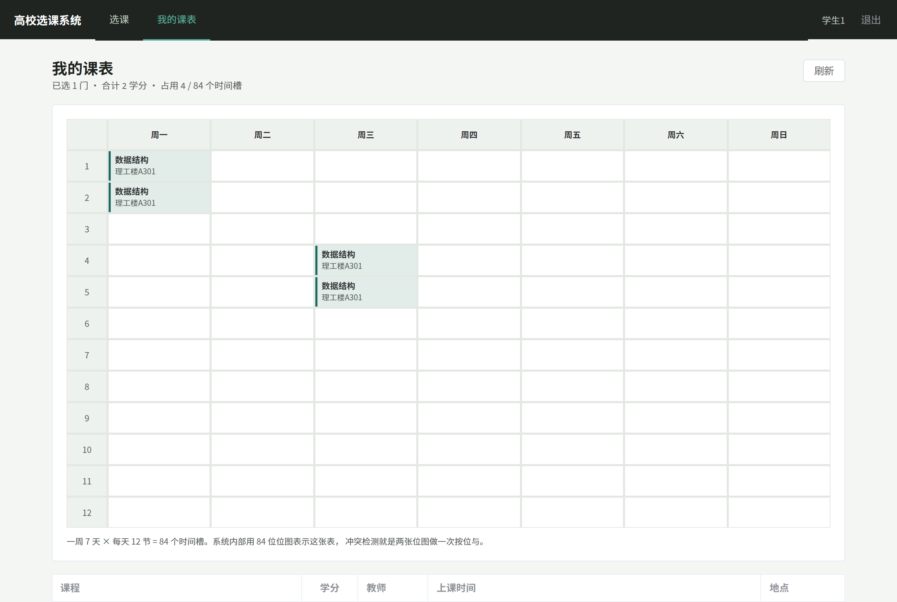<br><sub><b>学生 · 课表</b>　界面上一格就是位图里的一位</sub></td>
</tr>
<tr>
<td>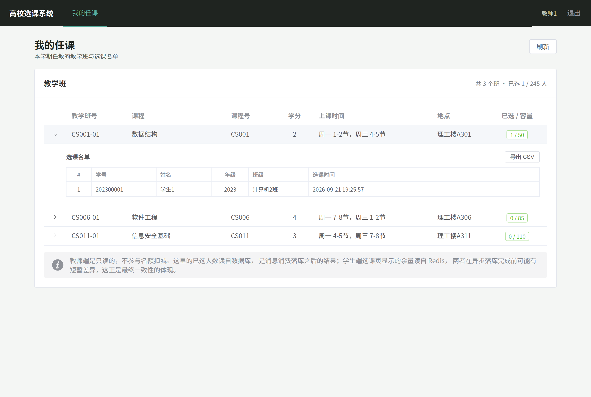<br><sub><b>教师 · 任课与名单</b>　只读，可导出 CSV</sub></td>
<td>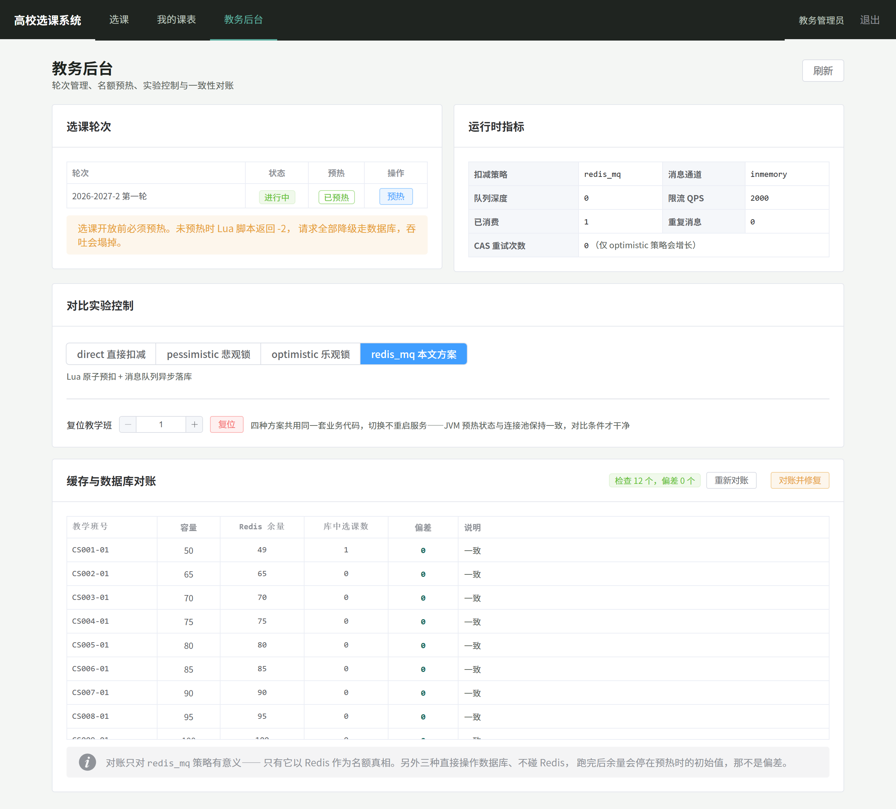<br><sub><b>教务 · 后台</b>　运行时切换扣减策略与对账</sub></td>
</tr>
</table>

教务后台的「对比实验控制」可以在**不重启服务**的情况下切换四种扣减策略——JVM 预热状态与连接池在各轮之间保持一致，对比条件比改配置重启干净得多。

---

## 快速开始

不需要 Docker、MySQL、RabbitMQ 或任何服务器。数据库是跑在 Java 进程里的 H2 内存库，消息队列是进程内实现，Redis 与 Maven 已随仓库提供。

```bash
# 1. Redis（必须最先起，窗口别关）
tools/redis/redis-server.exe tools/redis.conf

# 2. 后端（约 20–40 秒，自动建表灌数据）
tools/apache-maven-3.9.9/bin/mvn -s tools/settings.xml -f backend/pom.xml spring-boot:run

# 3. 前端
npm --prefix frontend install --registry=https://registry.npmmirror.com
npm --prefix frontend run dev
```

打开 <http://localhost:5173>。

| 账号 | 口令 | 角色 |
|---|---|---|
| `admin` | `123456` | 教务管理员 |
| `t001` ~ `t005` | `123456` | 教师 |
| `s0001` ~ `s3000` | `123456` | 学生 |

**首次使用先做一步**：用 `admin` 登录 → 教务后台 → 点「预热」。名额预热把数据库里的余量灌进 Redis，不做这一步所有请求会降级走数据库。后端重启后 H2 内存库清空，需要重新预热。

### 复现实验

```bash
# 接口层四方案压测（需三个服务在跑）
javac -d verify/loadtest/out -encoding UTF-8 verify/loadtest/LoadTest.java
java -cp verify/loadtest/out LoadTest --strategy redis_mq --concurrency 2000

# 时间位图对比实验
cd verify/bitmapbench
javac -encoding UTF-8 -cp ../../backend/target/classes -d out BitmapBench.java
java -cp "../../backend/target/classes;out" BitmapBench
```

压测端用 JDK 虚拟线程手写，零第三方依赖。原因见 [docs/DESIGN.md](docs/DESIGN.md#压测端为什么自己写)。

---

## 数据模型

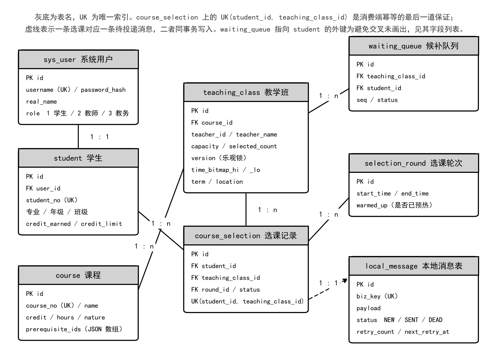

八张表。三张核心表是 `course`（课程固有属性）、`teaching_class`（某门课在某学期的具体班次，名额与上课时间在这一层）、`course_selection`（学生与教学班的多对多关联）。

`teaching_class` 里有三个字段值得一提：`version` 供乐观锁策略使用，`time_bitmap_hi` / `_lo` 是上课时间的位图编码，`selected_count` 是四种方案争抢的对象。

---

## 项目结构

```
├── backend/                     Spring Boot 3.3.5 + MyBatis-Plus
│   └── src/main/
│       ├── java/com/ncuky/cs/
│       │   ├── strategy/        ★ 四种扣减策略 + 统一接口
│       │   ├── mq/              消息发送、消费、本地消息表与重投
│       │   ├── service/         选课主流程、规则校验、预热、对账
│       │   ├── util/            ★ TimeBitmapUtil 时间位图
│       │   ├── security/        JWT 认证与 BCrypt 口令哈希
│       │   └── ratelimit/       令牌桶限流
│       └── resources/
│           ├── lua/deduct.lua   ★ 原子预扣脚本
│           └── db/schema-h2.sql dev 模式建表与种子数据
├── frontend/                    Vue 3 + Vite + Element Plus
│   └── src/
│       ├── views/               选课 / 课表 / 教师端 / 教务后台 / 登录
│       ├── stores/auth.js       登录态唯一真相源
│       └── router/              路由与角色守卫
├── verify/                      实验脚本与实测数据
│   ├── loadtest/                虚拟线程压测端
│   ├── bitmapbench/             位图对比实验
│   └── results/*.csv            全部实测数据，含方法说明
├── tools/                       绿色版 Maven 与 Redis，删了跑不起来
├── sql/schema.sql               MySQL 版建表（生产 profile 用）
└── docs/                        设计文档与配图
```

---

## 技术栈

**后端** Spring Boot 3.3.5 · MyBatis-Plus 3.5.7 · Redis（Lua/EVAL）· JWT · BCrypt · H2（dev）/ MySQL（prod）· RabbitMQ（prod）/ 进程内队列（dev）

**前端** Vue 3 组合式 API · Vite · Element Plus · Axios

**实验** JDK 虚拟线程压测端 · Python + matplotlib 出图

---

## 说明

本项目为本科毕业设计的代码部分。论文文稿未包含在本仓库内。

`tools/` 下的 Maven（Apache 2.0）与 Redis Windows 移植版（BSD）为第三方二进制，随仓库提供只是为了让项目开箱即跑，版权归各自作者所有。
